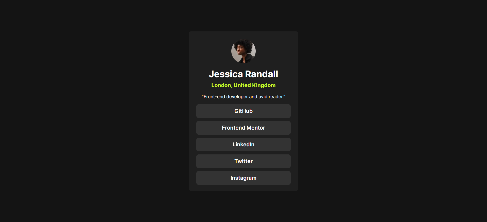
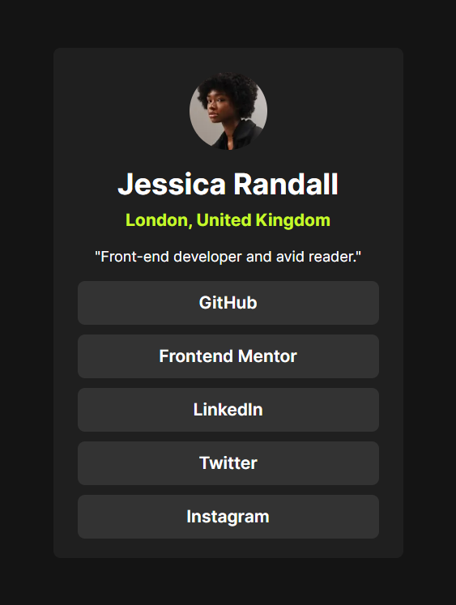

# Frontend Mentor - Social links profile solution

## Table of contents

- [Overview](#overview)
  - [The challenge](#the-challenge)
  - [Screenshot](#screenshot)
  - [Links](#links)
- [My process](#my-process)
  - [Built with](#built-with)
- [Author](#author)

## Overview

### The challenge

Users should be able to:

- See hover and active states for all interactive elements on the page
- See mobile view from 320px

### Screenshot

### Links

- Solution URL: [github repo](https://github.com/Ashraful-Mijan/social-links-profile-solution)
- Live Site URL: [live site](https://social-links-profile-solution-ten.vercel.app/)

## My process

### Built with

- [Next.js](https://nextjs.org/) - React framework
- Tailwind CSS
- Flexbox
- Mobile-first workflow

## Author

- Website - [Ashraful Mijan](https://ashrafulmijan.com/)
- Frontend Mentor - [@Ashraful-Mijan](https://www.frontendmentor.io/profile/Ashraful-Mijan)
